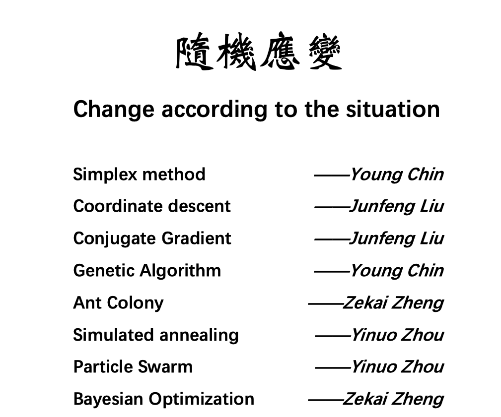

[PDF](./Simplex Method.pdf)

This is a blog to explain the classical linear programming method named ***Simplex Method*** from the question to the inference. Actually, this report is my final group project in the course ***Advanced Topics in Applied Mathematics*** advised by Prof . Xiaopin Lu. Our group had finished the topic ***Optimization Algorithm*** with sub-topics as follows. 

Here, I just post one of my own parts, which is my most unfamiliar one. In fact, I have learned about Simplex Method before, but haven't well understood the theory and just know how to compute on the table for passing the exam at that time. In addition, when I search for some blogs and literature, sadly I couldn't find some good pages explaining it well from shallow to deep. Therefore, I decided to post my simple and naive report and hope it could help you to get good knowledge about this simple but classical algorithm. 

Reference：

https://oi-wiki.org/math/simplex/

Unfinished ...
